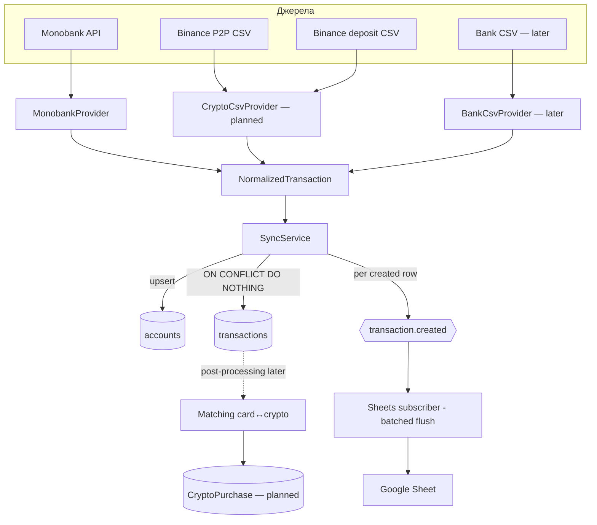

# Architecture Overview

Шарувата, source-agnostic. Ядро (normalize/sync) нічого не знає про конкретні джерела —
нове джерело додається збоку як провайдер. → [[Invariants]] #3, [[Providers]]

## Потік даних

## Шари
1. **Providers** (`src/providers/*`) — fetch + мапінг сирих полів у
   `NormalizedTransaction`. Знають своє джерело; більше нічого. → [[Providers]]
2. **Normalize** (`src/core/normalize`) — канонічний тип + чисті хелпери
   (`buildExternalId`, `money`, `toNormalized`). Source-agnostic.
3. **Sync** (`src/sync`) — watermark → `provider.fetch()` → upsert accounts →
   ідемпотентний insert → подія. → [[Sync Engine]]
4. **Events + Subscribers** (`src/events`, `src/subscribers`) — сайд-ефекти лише через
   `transaction.created`. → [[Events & Export]]
5. **Persistence** (`src/modules/*`, TypeORM) — сутності + міграції. → [[Data Model]]
6. **Composition root** (`src/app.module.ts`) + entrypoint `src/sync.command.ts`
   (`npm run sync`).

## Ключові технічні факти
- NestJS 11, TypeORM **1.0**, PostgreSQL 16 (`gen_random_uuid()` з ядра, без extension).
- Підключення БД — єдиний `DATABASE_URL`. `synchronize:false`, зміни схеми лише міграціями.
- Секрети — через `.env` (`MONOBANK_TOKEN`, Google service-account). → [[Invariants]]
