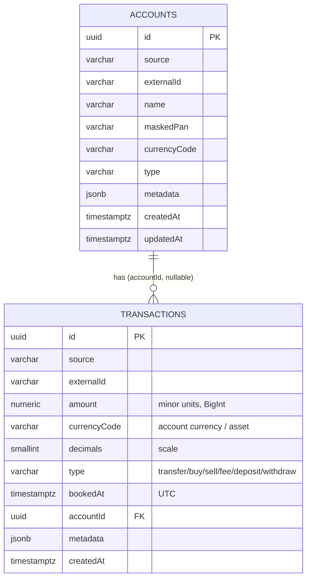

# Data Model

Схема через TypeORM-міграції (`synchronize:false`). Гроші — `numeric(38,0)` ↔ `BigInt`
(див. [[Invariants]] #1).

## ERD

## `transactions`
- **PK** `id` uuid (`gen_random_uuid()`).
- **`UNIQUE(source, externalId)`** — ключ дедупу/ідемпотентності (#4).
- `amount numeric(38,0)` + `currencyCode` + `decimals` — самодостатня сума.
  `numeric(38,0)` обрано, щоб крипта з великою точністю не переповнювала `bigint`.
- `type` — плоский enum (`TransactionType`); P2P-ознаки йдуть у `metadata`, окремого
  типу не заводимо (простота). → [[Decision Log]]
- `bookedAt timestamptz` (UTC). Індекси: `(bookedAt)`, `(accountId, bookedAt)`.
- `accountId` — FK → `accounts.id`, `ON DELETE SET NULL`, nullable.
- `metadata jsonb` — точка розширення: Monobank `mcc`, `operationAmount`,
  `operationCurrencyCode`, контрагент; майбутній крипто `tradeRef`/`groupId` для зв'язку
  ніг трейду (щоб не унеможливити FIFO PnL). → [[Card↔Crypto Matching]]

## `accounts`
- **PK** `id` uuid; **`UNIQUE(source, externalId)`**.
- Дисплей-поля: `name`, `maskedPan`, `currencyCode`, `type` — «картка ••1234 / UAH».
- Апсертиться синком (збагачується з кожним прогоном). → [[Sync Engine]]

## Міграції
1. `1719660000000-CreateTransactions` — таблиця `transactions`, UNIQUE, індекс.
2. `1719660000001-AddAccounts` — таблиця `accounts`, `transactions.accountId` FK+індекс,
   **бекфіл** existing рядків із `metadata->>'accountId'`.

## Плановані сутності
- **CryptoPurchase** — результат метчингу card↔crypto (крок 5). → [[Card↔Crypto Matching]]
