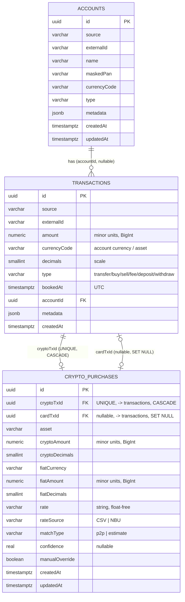

# Data Model

Схема через TypeORM-міграції (`synchronize:false`). Гроші — `numeric(38,0)` ↔ `BigInt`
(див. [[Invariants]] #1).

## ERD

## `transactions`
- **PK** `id` uuid (`gen_random_uuid()`).
- **`UNIQUE(source, externalId)`** — ключ дедупу/ідемпотентності (#4).
- `amount numeric(38,0)` + `currencyCode` + `decimals` — самодостатня сума.
  `numeric(38,0)` обрано, щоб крипта з великою точністю не переповнювала `bigint`.
- `type` — плоский enum (`TransactionType`); P2P-ознаки йдуть у `metadata`, окремого
  типу не заводимо (простота). → [[Decision Log]]
- `bookedAt timestamptz` (UTC). Індекси: `(bookedAt)`, `(accountId, bookedAt)`.
- `accountId` — FK → `accounts.id`, `ON DELETE SET NULL`, nullable.
- `metadata jsonb` — точка розширення: Monobank `mcc`, `operationAmount`,
  `operationCurrencyCode`, контрагент; майбутній крипто `tradeRef`/`groupId` для зв'язку
  ніг трейду (щоб не унеможливити FIFO PnL). → [[Card↔Crypto Matching]]

## `accounts`
- **PK** `id` uuid; **`UNIQUE(source, externalId)`**.
- Дисплей-поля: `name`, `maskedPan`, `currencyCode`, `type` — «картка ••1234 / UAH».
- Апсертиться синком (збагачується з кожним прогоном). → [[Sync Engine]]

## `crypto_purchases` (крок 5)
- **PK** `id` uuid. Результат post-processing шару метчингу card↔crypto — записується
  лише `MatchingService` (`npm run match`), провайдери й `SyncService` про цю таблицю не
  знають. → [[Invariants]] #5, [[Card↔Crypto Matching]]
- **`cryptoTxId`** — FK → `transactions.id`, `ON DELETE CASCADE`, **`UNIQUE`**: максимум
  один `CryptoPurchase` на крипто-приплив (одна нога = один запис).
- **`cardTxId`** — FK → `transactions.id`, `ON DELETE SET NULL`, nullable: картковий
  дебет, що профінансував покупку, якщо метч знайдено; `null` = unmatched. Індекс на
  `cardTxId`.
- `asset` + `cryptoAmount numeric(38,0)`↔`BigInt` + `cryptoDecimals` — крипто-сторона
  (з тієї ж ноги, що й `cryptoTxId`).
- `fiatCurrency` + `fiatAmount numeric(38,0)`↔`BigInt` + `fiatDecimals` — фіатна
  собівартість (з `transactions.metadata` крипто-ноги: `fiatAmountMinor`/
  `fiatCurrencyCode`/`fiatDecimals`).
- `rate varchar` — курс, **рядок** (float-free), копіюється як є з джерела.
- `rateSource` — `'CSV'` (P2P, крок 5) або `'NBU'` (estimate, крок 6).
- `matchType` — `'p2p'` (крок 5) або `'estimate'` (крок 6).
- `confidence real, nullable` — якість метчу в `[0,1]`; `null`, коли кандидата немає.
- `manualOverride boolean default false` — коли `true`, апсерт по `cryptoTxId`
  (`ON CONFLICT ... DO UPDATE ... WHERE "manualOverride" = false`) цей рядок більше не
  чіпає — ручне рішення користувача остаточне до явної зміни.

## Міграції
1. `1719660000000-CreateTransactions` — таблиця `transactions`, UNIQUE, індекс.
2. `1719660000001-AddAccounts` — таблиця `accounts`, `transactions.accountId` FK+індекс,
   **бекфіл** existing рядків із `metadata->>'accountId'`.
3. `1719660000002-AddCryptoPurchases` — таблиця `crypto_purchases`, FK `cryptoTxId`
   (CASCADE, UNIQUE) + `cardTxId` (SET NULL), індекс на `cardTxId`.

## Плановані сутності
- Estimate-розширення `CryptoPurchase` для unmatched депозитів (курс НБУ) — крок 6.
  → [[Card↔Crypto Matching]]
